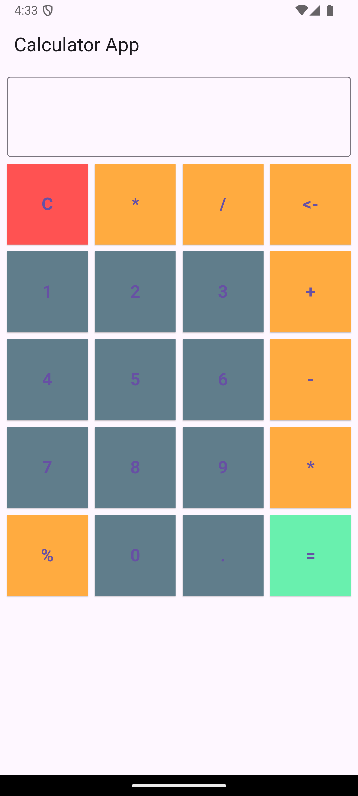

# Calculator App Practice

Welcome to the Calculator App Practice! This is a simple and elegant calculator application built using Flutter. Below are some screenshots and descriptions of the app's features.

## Features

- Basic arithmetic operations: addition, subtraction, multiplication, and division.
- Clear button to reset the input.
- Responsive design for different screen sizes.

## Screenshots

### Home Screen



The home screen of the calculator app. Here, you can see the input field and the grid of buttons for different operations and numbers.

### Performing Calculations


In this screenshot, you can see the calculator in action, performing a simple arithmetic operation.

### Clear Input


The clear button allows you to reset the input field, making it easy to start a new calculation.

## How to Use

1. **Enter Numbers**: Tap on the number buttons to enter numbers.
2. **Select Operation**: Tap on the operation buttons (`+`, `-`, `*`, `/`) to select the desired arithmetic operation.
3. **Calculate**: Tap on the `=` button to perform the calculation.
4. **Clear**: Tap on the `C` button to clear the input field.

## Installation

To run this app on your local machine, follow these steps:

1. Clone the repository:

# Calculator App Practice

Welcome to the Calculator App Practice! This is a simple and elegant calculator application built using Flutter. Below are some screenshots and descriptions of the app's features.

## Features

- Basic arithmetic operations: addition, subtraction, multiplication, and division.
- Clear button to reset the input.
- Responsive design for different screen sizes.

## Installation

To run this app on your local machine, follow these steps:

1. Clone the repository:
   ```sh
   git clone https://github.com/yourusername/calculator_app_practice.git
   ```
2. Navigate to the project directory:
   ```sh
   cd calculator_app_practice
   ```
3. Install dependencies:
   ```sh
   flutter pub get
   ```
4. Run the app:
   ```sh
   flutter run
   ```

## Contributing

Contributions are welcome! If you have any suggestions or improvements, feel free to create a pull request or open an issue.

## License

This project is licensed under the MIT License. See the [LICENSE](LICENSE) file for more details.

---

Thank you for checking out the Calculator App Practice! If you have any questions or feedback, please don't hesitate to reach out.
